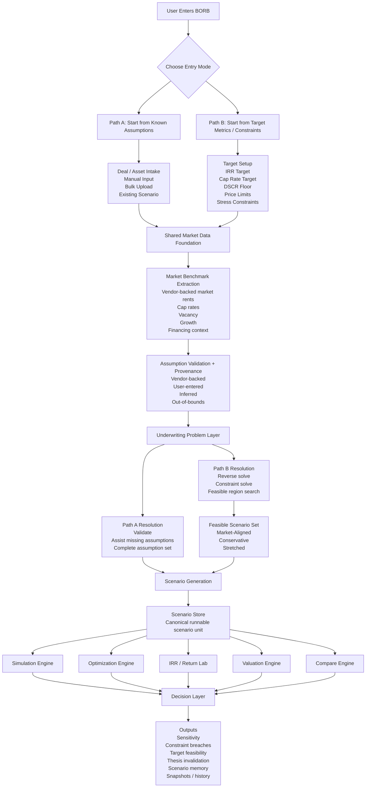
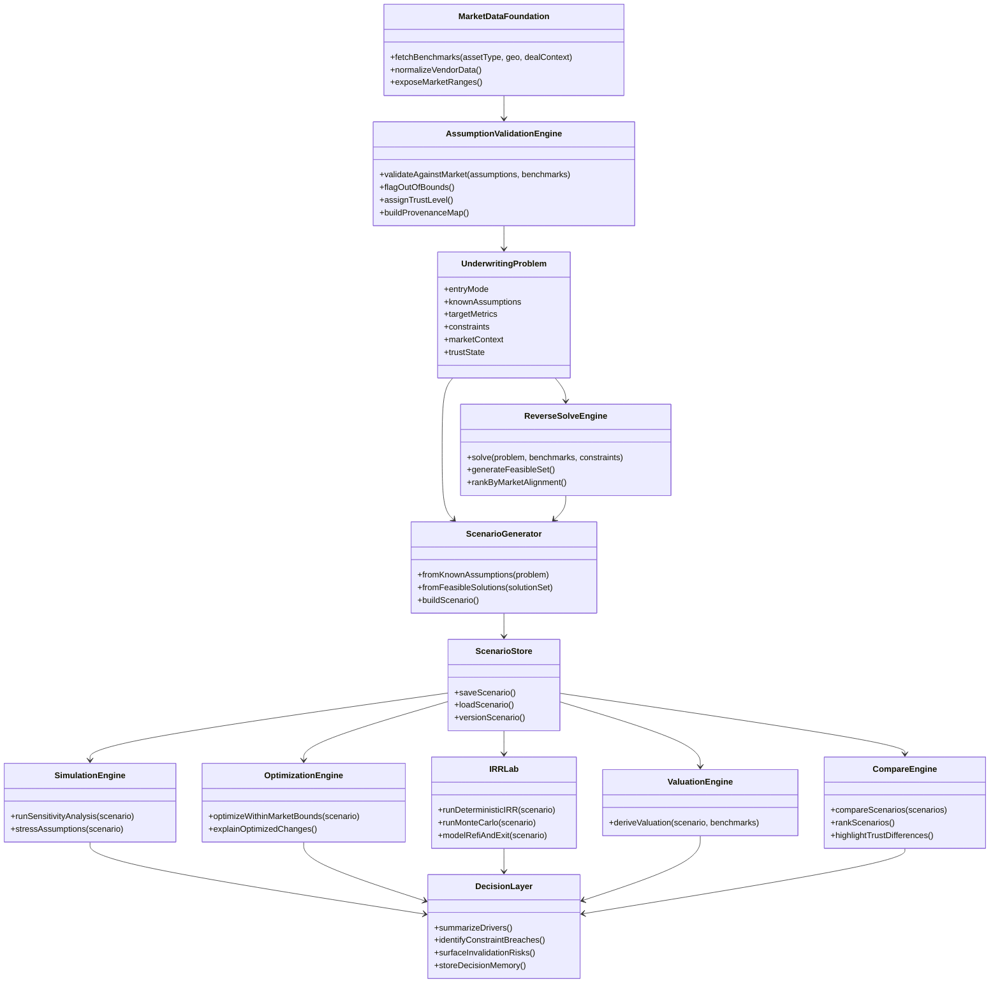
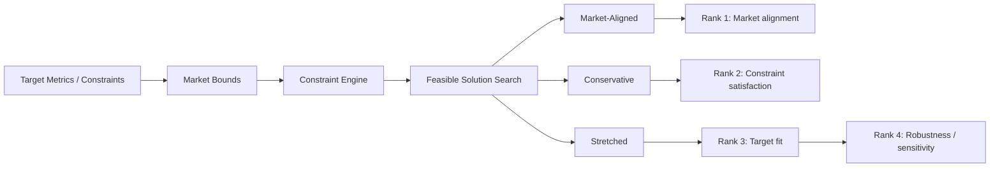
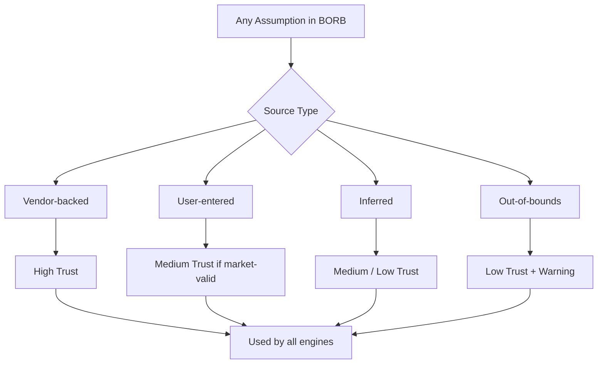
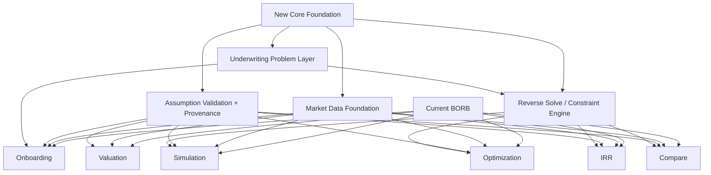

# BORB Architecture Diagrams

These diagrams capture the high-level redesign of BORB as a market-grounded, constraint-aware institutional underwriting system.

## 1. Product Flow Diagram

## 2. UML-ish Component Diagram

## 3. Reverse-Solve Decision Logic

## 4. Trust / Provenance Model

## 5. Current-to-Future Module Mapping

