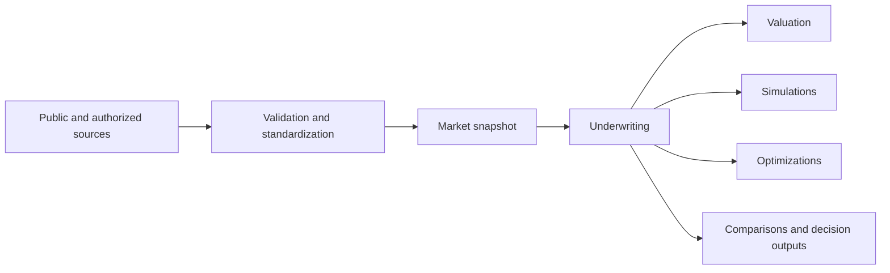

# How Market Data Flows Through BORB

## At a glance

BORB connects market evidence to underwriting and decision tools while keeping the source, date, confidence and limitations visible.

Market data informs the analysis. It does not silently replace your deal assumptions, guarantee an outcome or remove the need for professional review.

## The flow

### 1. Evidence is collected

Depending on location and availability, evidence can include:

- public parcel and assessment records;
- zoning and land-use records;
- public economic, housing, employment, rate and hazard datasets;
- reviewed sale comparables;
- authorized property operating documents;
- subject-specific commercial insurance evidence.

Availability varies by geography and property. BORB identifies missing coverage instead of inventing a value.

### 2. Evidence is checked

Before market data can support analysis, BORB checks items such as:

- the property and geography match;
- the source and retrieval date;
- required fields and units;
- freshness and completeness;
- supporting records and review status;
- whether the value is observed, derived, modeled or provisional.

Some evidence requires human review before it can be used in a production underwriting workflow.

### 3. A market snapshot is created

A market snapshot freezes the accepted evidence for a specific property and point in time. It includes field-level source information, confidence, warnings and missing items.

Freezing the snapshot matters because two analyses should not appear identical if they were based on different evidence.

## How BORB uses the snapshot

### Underwriting validation

BORB can compare scenario assumptions with available market evidence. It may identify an assumption as supported, outside an observed range, missing evidence or requiring acknowledgement.

The platform does not automatically turn a warning into an approval.

### Reverse solving

BORB's target-led workflow can work backward from goals such as return or coverage requirements to explore feasible deal structures. Market context helps place realistic boundaries around material assumptions.

A result may be feasible, fragile or blocked. A blocked result is useful: it identifies what evidence, input or constraint prevents a reliable solve.

### Scenario creation and promotion

When an eligible solver result is saved as a scenario, its origin remains connected to the target, assumptions and market snapshot used to produce it.

### Financial metrics

BORB uses deterministic financial calculations for metrics such as income, NOI, debt service, coverage and returns. Market data informs the inputs and their reliability; it does not replace the calculation engine.

### Valuation

Market evidence can support comparable-sale and cap-rate context. BORB distinguishes direct observations from modeled estimates and presents reliability guidance when evidence is limited.

### Simulations

Simulations explore how a saved scenario behaves when assumptions or events vary. The market snapshot provides the starting context, while the simulation clearly represents stressed or changed assumptions.

### Optimizations

Optimization explores alternative scenario configurations for profitability, growth, risk or efficiency. Recommendations remain bounded by available inputs and should be reviewed before being saved or used.

### Comparisons

BORB can compare original, simulated, optimized or solver-derived scenarios. A useful comparison includes more than metric changes: users should also consider changes in assumptions, evidence quality and uncertainty.

### Reports and decision support

Decision outputs can bring together scenario assumptions, financial results, market context and unresolved cautions. These outputs support a decision process; they are not appraisals, legal opinions or guarantees.

## What users may see

| Status or signal | What it means |
|---|---|
| Supported | Available evidence supports the input or output within the stated scope |
| Derived | The value was calculated from identified evidence |
| Modeled | The value is an estimate based on assumptions or indirect observations |
| Provisional | Useful for preview or development, but not fully approved evidence |
| Missing | BORB does not have sufficient evidence for the field |
| Blocked | A required input, evidence item, review or compatibility check has not passed |
| Stale | Evidence exists but may be too old for the intended decision |

## Good user practice

- Review the snapshot date and property identity.
- Open source and confidence details for material assumptions.
- Read warnings and missing-evidence notices.
- Compare changed assumptions as well as changed returns.
- Do not treat a modeled or provisional value as an observed fact.
- Ask for qualified legal, insurance, appraisal, tax or engineering advice where appropriate.

## Important limitations

Market-data coverage varies by county, municipality, source availability and licensing or access rules. Some workflows may remain unavailable until evidence and required reviews are complete.

BORB supports underwriting judgment. It does not guarantee investment performance or replace independent due diligence.

## Related guides

- [Collections and Scenarios](../collections-scenarios/README.md)
- [Metrics and KPI Basics](../metrics/README.md)
- [Simulations](../simulations/README.md)
- [Optimization](../optimization/README.md)
